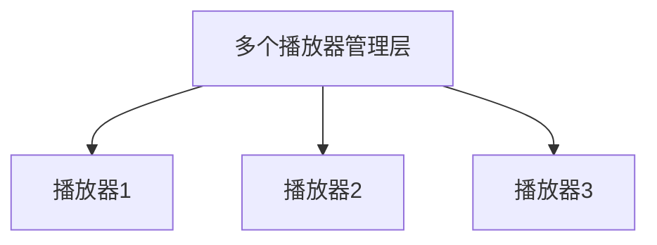
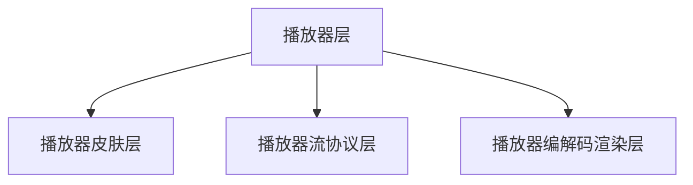
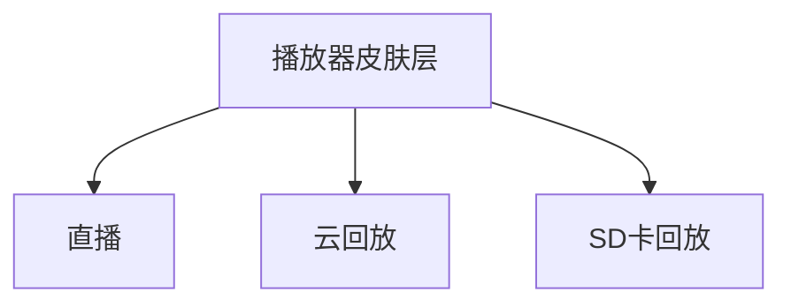

# iOS IPCamera 播放器组件设计

### 背景

播放器的业务复杂度非常高，界面元素控件非常多，类型多样，并且集中在一个页面展示。网络协议多样化，需要处理不同的网络传输协议(RTSP/RTMP/HLS等)。播放器编解码渲染核心依赖第三方库(FFMPEG/H264/AAC等)，需要性能优化等问题。因此，如果无规划的堆叠代码会导致功能混乱，造成最终代码无法维护的结果。

面对种种问题，我们提出了**面向接口化的方案来实现播放器设计**，**将每一层的接口，自上而下进行隔离，并保证接口在本层的通用性，可扩展性，解决以上问题的同时，兼容目前主流的h5原生混合开发的模式，最终提供组件给第三方进行调用**。


### IPC播放器组件整体架构

.png)

如图所示，我们将上面所涉及的需求业务，**划分为4个层级**

1. **组件调用层** 其他组件可以通过组件调用的方式调用多播放器管理层，同时也兼容了h5的消息转义，将消息转化为组件调用。
2. **多播放器管理层** 用于解决同时存在多个播放器并需要管理的情况
3. **播放器层** 管理某一个播放器的层级
4. **播放器平行层** 皮肤层/流协议层/编解码渲染层


#### 组件调用层

**组件调用层，处理消息的转发外，为了兼容h5的消息调用，也会将h5的JSBridge消息，转发组件调用，用来实现h5还是原生都能共用一套代码和机制，这样生成的组件库，适用于原生的sdk 也适用于混合开发，兼容性更好。**

组件调用的源头是组件化，组件化其实是一种设计模式，用来解耦各个独立的组件库，从而将组件的能力复用到不同的项目中去，减少迁移成本，同时通过统一的调用规则，保证调用人无需过多了解组件的具体实现，减少了沟通成本同时让组件开发人更专注于组件开发。组件的实现用两种方式，一种是url，一种是taget-action,我们选用的是target-action的方案，如果不了解，可以参考[Casa Taloyum]的[iOS应用架构谈 组件化方案](https://casatwy.com/iOS-Modulization.html)文章去深入学习，这套方案把函数调用理解为 消息转发，只需要知道发送的对象，发送的服务，以及传递参数即可实现函数调用。消息中心会将这样格式的内容，分发到对应的组件去。

```objective-c
 [MessageCenter requestWithService:@"Player" action:@"create" params:@{@"type":@(0)} callback:nil];
```

上面的代码的含义是 消息中心调用Player模块的create来创建播放器，这样调用方永远只需要关注Service:action: params:这三个参数。而不用关注播放器具体怎么实现了。

播放器组件则会这么处理 ，就完成了组件调用到实现的过程。

```objective-c
if([@"create" isEqualToSting action]) {
  [PlayerManager createPlayerWithType:type];
}
```

组件调用层，处理消息的转发外，为了兼容h5的消息调用，也会将h5的JSBridge消息，转发组件调用，用来实现h5还是原生都能共用一套代码和机制，这样生成的组件库，适用于原生的sdk 也适用于混合开发，兼容性更好。h5的jsbridge和原生通信原理不是本文的重点，我们只需要知道h5下发给原生的消息是json形式的即可。

我们把JSON要求为字典格式，并要求统一的传递规则

```json
{
  "data" : {
    "service" : "Player",
    "action":"create",
    "type" : 0,
  }
}
```

组件只关注data字段即可，发现data中正好对应了组件发送的Service:action: params:这三个参数，由此可见，当我们需要处理来自h5的消息，只要把json转成字典，然后填写到消息中心即可完成转发 ，此时就和原生调用完全一致了。

```objective-c
 [MessageCenter requestWithService:JSON[@"service"] action:JSON[@"action"] params:JSON callback:nil];
```


#### 多个播放器管理层

**播放器管理类PlayerManager是单例，用来管理多个播放器实例，并转发具体的消息给某个播放器**，最初的业务来源是一个界面上需要展示多个播放器，不同的播放器状态类型不同，所以需要管理类，来持有播放器，当进行调用创建销毁的时候能够找到对应的播放器，并将消息转发给对应的播放器，现在更多的是用于h5对播放器的销毁操作，由于h5是单页面元素，页面销毁出现异常的情况下，无法拿到播放器实例对应的handle，只能发送没有参数的销毁动作，这时候IPC管理类可以根据需求，销毁当前最后一个创建的播放器或者销毁全部的播放器实例。




```
- 管理多个播放器业务
- 转发单个播放器消息
```


#### 播放器层

**播放器层创建的时候，会创建者三个层的对象，皮肤层负责展示界面元素，协议层负责拉流，渲染层来播放音视频，从而实现了播放器的功能集。**

播放器层如果不进行抽象，那么所有的逻辑都会堆叠在这里，比如创建写了一个直播播放器，然后需要开发sd卡播放器，就继承一个直播播放器，再根据type传入sd卡的类型，再把所有的SD卡的协议实现一遍，再增加SD卡的逻辑UI。不知不觉中，代码就会越来越长，而且因为使用了继承，不需要的代码，又都实现了一遍，造成了重复。所以我们需要进行抽象，但并不是抽象成 直播/回放/SD卡，因为这是具体的业务，是可变的，不是抽象接口稳定的需求，我们通过归纳总结发现，播放器层总是需要皮肤，来展现播放暂停功能，截图录像 还有隐藏显示等效果，所以分离出这个层级，来转码处理播放器控件皮肤的管理。再进一步，播放器总是需要数据来源的，可以是来自网络的视频流，网址，也可以是来自本地文件，无论来自哪里，我们都需要这一个数据流协议层，用来解析来自不同数据源的数据，最后一个也是最为核心的类，播放器界面渲染层，是用来将视频数据解码后渲染在视图上，将音频数据解码后推到扬声器中播放，因为苹果系统没有提供非常全面的实现能力，一般需要编解码类的专业人才来实现这块核心功能。




#### 播放器类型

**播放器类型是变化的，会作为枚举在层级中流转**

前面一直没有具体说是直播播放器、SD卡播放器、云回放播放器、是因为播放器的类型是可变并且可扩展的，现在我们完成了层级的抽象，就可以将具体的播放器类型层层传递下来，为什么这样做，因为播放器类型根据不同的业务很有可能出现 另外一种协议的直播，云回放，sd卡协议，这种变化是无法限制的，只能将变化传入，只要在创建的时候传入某个规定好的类型，具体的三个层会生成自己具体的实现类，来达到不用修改旧代码，调用规则一致的目的。

以下是代码中消息的流转

```objective-c
//组件调用层层 MessageCenter->PlayerManager  
[MessageCenter requestWithService:@"Player" action:@"create" params:@{@"type":@(0)} callback:nil];
//多播放器管理层 PlayerManager->Player
 [PlayerManager createPlayerWithType:type];
//播放器层 Player
 [Player createPlayerWithType:type];
//播放器皮肤层 Player->PlayerSkin
 [PlayerSkin createPlayerWithType:type];
//播放器流协议层 Player->PlayerFentch
 [PlayerFentch createPlayerWithType:type];
//播放器编解码渲染层 Player->XPlayer
 [XPlayer createPlayerWithType:type];
```

再往下，我们会在ipc业务类创建的时候 传入对应的播放器枚举类型，这样对应的基类 就会根据枚举值，创建不同的子类了。展现是这样的



用树形结构表示是这样的

```ruby
播放器层
└── 播放器皮肤层
│     ├── 直播
│     ├── 云回放
│     ├── SD卡回放
└── 播放器流协议层
│     ├── 直播
│     ├── 云回放
│     ├── SD卡回放
└── 播放器编解码渲染层
│     ├── 直播
│     ├── 云回放
│     ├── SD卡回放
```

这里一般用组合而不是用继承来实现这样的设计模式，因为继承会造成父类过度庞大，不需要的实现也必须实现了。组合可以根据具体的业务选择实现的部分，唯一的缺点是组合需要一直编写是否实现了对应的方法，增加了一定的代码量。


#### 播放器皮肤层

**皮肤层是对UI界面的管理，依赖于业务，同时又容易抽离**。

```
- 创建
- 设置皮肤相关参数(主题色/按钮状态/ui样式)
- 设置状态(开始/暂停/继续/停止)
- 设置进度(时间/百分比)
- 录像(开始/停止)
- 屏幕旋转(横屏/竖屏)
- 响应事件上报(点按/滑动/拖拽)
```

这个类变化很多，很难做到通用，如果想在播放器层这里最大限度简化皮肤层的接口数量和通用性，只能如下面的代码

```objective-c
- (void)setSkinConfig:(NSDictionary *)config;
```

利用字典将各种参数状态包装起来，再通过 setSkinConfig传递给具体实现的类，具体实现的类通过解析字典中的每个key值，如果有对应的值，则展现出不同的状态。如果界面改动了，比如config 字典中有个key为 show参数，值为yes，那么这里就可以对应界面的某个控件的隐藏和显示了，产品的界面ui变更了 只需要修改config的传递参数，界面层解析到了新的参数，就会按照新的规则去处理了。这样的好处是，无需关注具体的皮肤变化，而是把整个皮肤所有相关配置参数进行整体传递，皮肤层有能力，就处理，没有能力，就按照旧的实现。最重要的一点就是解除了播放器层 和播放器皮肤层的强耦合关系，当需要迁移皮肤层的时候，不需要把播放器的各种解析字段的逻辑一起迁移过去，因为播放器只是起到了中转的作用，并不关心具体的实现。这样也大大简化了播放器层的代码量。


#### 播放器流协议层设计

**流媒体协议依赖于业务，扩展性强，但也能一定程度的通用**

```
- 创建/释放
- 设置请求参数
- 设置请求状态(开始/暂停/继续/停止)
- 请求流数据上报
- 请求状态上报
- 请求异常上报
```

流协议有很多种，常见的网络协议有hls/rtsp/rtmp/ 还有一些私有的tcp/P2P透传，而本地协议则就是本地的文件读取，不同的协议，都需要按照网络协议的规则去，建立连接，拉流，断开，心跳等处理，如果这样每个协议都写到播放器层里面，那么播放器层不久就会充斥着各类协议代码，越来越大，非常不好看，这时候，我们就要将这些协议里面只对播放器关心的通用部分封装出来，那么播放器层到底关心的是那些呢？回想整个数据传输的过程，无论是哪一种协议，都逃不出创建，销毁，获取数据，异常处理，于是我们把这些封装出来，但流式数据还有特殊之处，他会源源不断的送过来，可以类比下载的过程，只要用户不停止，在下载结束之前，就会源源不断的接收数据，所以我们需要当前的下载进度，还需要一些下载的状态，来标识当前下载是否暂停，恢复等，所以又提出了请求状态的接口。最后也是需要通过播放器类型以及其他的类型参数，来选择不同的实现协议，去完成具体建立连接，拉流等操作，这些实现，也是通过组合的方式，接口类并不关心实现。


#### 播放器编解码渲染层

**播放器的编解码渲染，是基于功能的，单独也是一个可以迁移的播放器SDK核心库模块**

```
- 创建/释放
- 添加/移除视频层
- 播放状态控制(开始/暂停/结束)
- 发送流数据(类型、时间戳、大小)
- 发送流数据状态(开始/暂停/结束)
- 音量控制
- 截图
- 录像
- 播放状态上报
- 播放异常上报
- 播放时间信息上报
```

实现了播放器的视频播放，声音播放的核心层级，需要通过传递的类型来决定要实现的组合接口。因为有些播放器是不需要进度条控制和跳播的，这个最基本的接口就能够覆盖全功能了，但这只是冰山一角，底下的实现逻辑是非常复杂的，但这不是本文的重点，本文的的重点是设计通用的接口，这里有个 发送流数据接口的设计，因为流数据可能是音频，可能是视频，也有可能是复用流，如果是视频流，那么会到视频解码线程处理，音频流则到音频流解码线程处理，如果是复用流。则要解析成视频流和音频流，再转入对应的线程进行处理，但接口只用这一个即可，传递的类型可以变化，这样就不用指定三个接口，视频/音频/复用流数据接口，而只用一个就同一了传递流数据的接口。


最后提供一份播放器编解码渲染层内部的一些具体实现。如有后文会详细讲解这部分。

**播放器流协议层**其实可以合并到播放器编解码渲染层里面，但为什么独立出来，不放在核心编解码层里面，是因为播放器的编解码渲染层，大部分时间是以静态库来实现的，静态库的特点是版本稳定后较少修改，而协议层其实和各个公司的业务相关性非常大，很可能经常修改，所以将这部分拿出来了，如果协议层稳定了，可以再移动到编解码渲染层里面，有些类似稳定的业务会发展成为中台的一部分。

.png)


